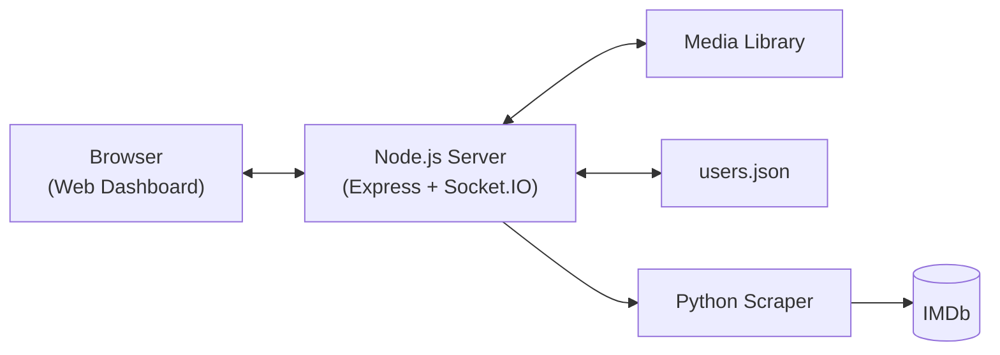

# CineBox

A self-hosted media server for families: browse trending movies (scraped from IMDb), manage your local media library, add torrents, and control everything from a clean web dashboard — with real authentication, role-based admin access, and hardened security out of the box.
Was a personal project as first but decided to make it public
AI was used to correct messy code and add some features (I don't have full knowledge at the moment, just graduated highschool)

## Features

- 🎬 Trending movies feed, auto-scraped from IMDb on every server start
- 📁 File manager (rename, move, delete, download)
- 🌊 Torrent uploads with live progress via WebSockets
- 👤 Real server-side sessions, scrypt-hashed passwords, brute-force lockout
- 🔑 Admin-only Server page: stop/restart the server, manage the IP allowlist, manage users
- 🛡️ CSRF protection, path-traversal protection, clickjacking protection, rate limiting

## Architecture



## Installation

Requires **Node.js 18+**, **Python 3.8+** and **aria2c**.

```bash
sudo apt update && sudo apt install aria2
git clone https://github.com/TheRedmc-Off/CineBox.git
cd CineBox
npm install
pip install -r public/python/requirements.txt
node server.js
```

Runs on port `8080` by default, on all network interfaces. Restrict access before exposing it to your network:

```bash
node server.js --localhost -p 8080        # only 127.0.0.1
node server.js --allowlist -p 8080        # only IPs in public/json/allowlist.json
```

## CLI Flags

| Flag | Alias | Description |
|---|---|---|
| `--port` | `-p` | Port to run on (default `8080`) |
| `--localhost` | `-l` | Only accept connections from `127.0.0.1` |
| `--allowlist` | `-a` | Only accept connections from IPs in `public/json/allowlist.json` |
| `--noid` | | Bypasses authentication, IP restrictions, and logout entirely — local testing only |
| `--help` | `-h` | Show CLI usage |

## First Login

Ships with a seed account: **`admin` / `admin`**. Log in, then immediately change the password and/or create your own admin account from the Server page.

Passwords are hashed with `crypto.scrypt` (Node's native, memory-hard KDF). If you ever hand-edit `users.json`, a plaintext `"password"` field is auto-hashed on the next server start.

## Usage

- **Home**: trending IMDb movies, with a manual "Refresh scraping" button
- **File Manager**: browse/rename/move/delete/download under `Media/`
- **Torrent**: upload a `.torrent` file, watch live progress
- **Profile**: change your username, upload an avatar
- **Server** *(admin only)*: stop/restart the server, manage the IP allowlist, and manage users (create, rename, delete, promote/demote admin, reset passwords) — a safeguard prevents removing or deleting the last remaining admin

## Security

| Protection | Implementation |
|---|---|
| Passwords | `crypto.scrypt` + per-user salt + timing-safe comparison |
| Sessions | Server-side, `httpOnly` cookie |
| CSRF | Double-submit cookie pattern (`csrf` library) on every state-changing request |
| Brute-force | `express-rate-limit`, 10 attempts / 15 min on `/auth` |
| Path traversal | Every file route validates it stays inside `Media/` |
| Clickjacking | `X-Frame-Options: DENY` + CSP `frame-ancestors 'none'` |
| Admin authorization | Enforced server-side on both API routes and the static admin page |

## API Reference

`LOCK` = requires a session · `ADMIN` = requires `admin: true` · `CSRF` = requires `X-CSRF-Token`

| Method | Route | Access | Description |
|---|---|---|---|
| `POST` | `/auth` | Public (rate-limited) | Log in |
| `POST` | `/logout` | LOCK+CSRF | Log out |
| `GET` | `/api/csrf-token` | Public | Get a CSRF token |
| `GET` | `/api/users/:username` | LOCK | Get a profile (self or admin) |
| `POST` | `/api/users/username`, `/api/users/avatar` | LOCK+CSRF | Update your own profile |
| `GET/POST` | `/api/admin/users` | ADMIN(+CSRF) | List / create users |
| `PUT/DELETE` | `/api/admin/users/:username` | ADMIN+CSRF | Update / delete a user |
| `POST` | `/server/stop`, `/server/restart`, `/server/append` | ADMIN+CSRF | Server controls |
| `POST` | `/scraper` | CSRF | Trigger a manual scrape |
| `GET` | `/movies`, `/series`, `/files` | Public | Browse media/library |
| `POST/DELETE` | `/rename`, `/delete`, `/move` | CSRF | File operations |
| `GET` | `/download` | Public | Download a file |
| `POST` | `/upload_file`, `/api/torrent/upload` | CSRF | Start a torrent job |
| `GET/POST` | `/api/torrent/status/:jobId`, `/api/torrent/cancel/:jobId` | Public / CSRF | Torrent job control |

## Project Structure

```
CineBox/
├── server.js
├── Media/                # your media library
├── public/
│   ├── css/ js/ imgs/
│   ├── json/              # users.json, scrapedMovies.json, allowlist.json
│   ├── pages/content/     # home, movies, series, torrent, filemanager, profile, server
│   └── python/            # scraper.py
└── testing/tools/         # self-testing security scripts (point at your own instance only)
```

## Legal & Scope

CineBox is a personal media library manager (same spirit as Jellyfin/Plex/Sonarr), not a piracy tool: no indexer, no tracker, ships with no media. You're responsible for the legality of any content you add to your own library.

## License
MIT